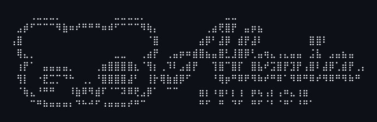

<div align="center">



# Zenith Nerve Tools (Alenia Apps)

**¡Bienvenido al monorepo oficial de Zenith Nerve Tools de Alenia Studios! Este repositorio alberga nuestras potentes y ligeras herramientas de edición y procesamiento de medios interactivos.**

*Leer en otros idiomas: [🇬🇧 English](README.md) | [🇪🇸 Español](README.es.md)*

[](https://gitgem.org/github/Kaia-Alenia/zenith-nerve-tools)
[](https://github.com/Kaia-Alenia/zenith-nerve-tools/actions)
[](https://github.com/Kaia-Alenia/zenith-nerve-tools/releases)
[](https://github.com/Kaia-Alenia/zenith-nerve-tools/releases)
[](https://www.gnu.org/licenses/gpl-3.0)
[](https://www.python.org/)

[](https://www.patreon.com/alenia_studios)
[](https://ko-fi.com/alenia_studios)
[](https://www.paypal.com/ncp/payment/TCCYMCFSVMV8E)
[](https://alenia-studios.itch.io/)

<br/>

</div>

La arquitectura de este repositorio ha sido estructurada siguiendo las directrices modernas de empaquetado de Python (PyPA) en modo **Monorepo**, donde las aplicaciones nativas conviven e interactúan gracias a un núcleo compartido (`alenia_bridge`).

---

## Librerías Core Open-Source

La magia de nuestro ecosistema es impulsada por dos robustas librerías open-source que hemos desarrollado. Siéntete libre de explorarlas y utilizarlas:

- **[Alenia Zenith](https://github.com/Kaia-Alenia/alenia-zenith)**: El acelerador de aplicaciones. Actúa como un bootstrapper que reduce drásticamente los tiempos de carga, asegurando que las aplicaciones en Python se abran casi al instante.
- **[Alenia Nerve](https://github.com/Kaia-Alenia/alenia-nerve)**: El cerebro de nuestro IPC. Permite una comunicación ultra rápida de baja latencia por sockets entre herramientas independientes.

---

## Herramientas de la Suite

Nuestra suite está compuesta por herramientas minimalistas y de alto rendimiento desarrolladas en Python y compiladas nativamente. 

### 1. Framegrid (FG.SLICER)
<p>
  <a href="https://github.com/Kaia-Alenia/zenith-nerve-tools/releases/latest/download/framegrid-Windows.zip"></a>
  <a href="https://github.com/Kaia-Alenia/zenith-nerve-tools/releases/latest/download/framegrid-macOS.zip"></a>
  <a href="https://github.com/Kaia-Alenia/zenith-nerve-tools/releases/latest/download/framegrid-Linux.tar.gz"></a>
</p>

**Framegrid** es un cortador de spritesheets de precisión. Está diseñado específicamente para tomar grandes hojas de texturas (spritesheets) de videojuegos o animaciones y extraer cada "fotograma" de forma automatizada.
- **¿Qué hace?** Lee imágenes individuales o directorios completos y los "rebana" (slice) matemáticamente basándose en un bloque de anchura (Width) y altura (Height) personalizados.
- **Casos de uso**: Separar los cuadros de un personaje caminando (e.g. un spritesheet de 256x256 en 16 imágenes de 64x64).
- **Eficiencia**: Procesa múltiples imágenes usando cálculos precisos sin pérdida de calidad.

### 2. Giftly
<p>
  <a href="https://github.com/Kaia-Alenia/zenith-nerve-tools/releases/latest/download/giftly-Windows.zip"></a>
  <a href="https://github.com/Kaia-Alenia/zenith-nerve-tools/releases/latest/download/giftly-macOS.zip"></a>
  <a href="https://github.com/Kaia-Alenia/zenith-nerve-tools/releases/latest/download/giftly-Linux.tar.gz"></a>
</p>

**Giftly** es un motor de ensamblaje de animaciones. Toma fotogramas individuales (o un spritesheet que corta en el momento) y los convierte en archivos `.gif` fluidos y optimizados.
- **¿Qué hace?** Genera y previsualiza animaciones proporcionando un control total sobre parámetros artísticos como Fotogramas por Segundo (FPS), factor de Escala (para pixel art) y el Color de Fondo (soporta máscaras alfa y transparencias verdaderas).
- **Características**: Puede procesar archivos en lote, y redimensiona (mediante un muestreo `NEAREST` ideal para pixel-art) los cuadros para exportar visuales impecables.

---

## Zenith y Nerve: El Ecosistema Central

La verdadera magia detrás de la suite de Alenia es la integración fluida de nuestras dos librerías fundacionales: **Zenith** para la interfaz y **Nerve** para la comunicación entre procesos (IPC) a través de `alenia-bridge`.

### Zenith: Aceleración y Arranque Instantáneo
Las aplicaciones de Python tradicionalmente pueden tardar en iniciar, pero tanto **Framegrid** como **Giftly** están impulsadas por **Alenia Zenith**. Zenith funciona como un bootstrapper y optimizador de arranque (`zenith.ignite()`) que elimina los retrasos comunes de inicio en Python. Gracias a esto, nuestras herramientas se abren de forma casi instantánea, ofreciendo una experiencia fluida y nativa desde el primer segundo.

#### ¿Cómo funciona Zenith?

```text
              [Punto de Entrada de la App]
                         │
               ( zenith.ignite() )
                         │
         ┌───────────────┴──────────────────┐
         ▼                                  ▼
[Hook en sys.meta_path]           [ThreadPoolExecutor]
 ZenithLazyFinder                  workers=4 (por defecto)
 Devuelve un módulo proxy          Precarga módulos cacheados
 en el primer import               eludiendo el GIL por hilo
         │                                  │
         ▼                                  ▼
[Primer acceso al atributo]       [Módulo listo en sys.modules]
 llama a _zenith_load_module()     El hilo principal obtiene el
 Carga el módulo real bajo demanda módulo real al instante
```

1. **Lazy Import Hook**: `ZenithLazyFinder` se inserta en el índice 0 de `sys.meta_path`. Cada nueva declaración de importación (import) devuelve un proxy ligero `ZenithLazyModule` en lugar de ejecutar el módulo inmediatamente. El módulo real solo se carga la primera vez que se accede a uno de sus atributos.
2. **Pre-cargador Especulativo**: Un `ThreadPoolExecutor` (4 hilos por defecto) precarga los módulos desde la caché persistente en hilos en segundo plano. Un bypass local a nivel de hilo evita que los hilos en segundo plano creen más proxies perezosos (lazy proxies), asegurando que carguen los módulos reales.
3. **Caché Persistente**: Al salir, Zenith escribe un archivo `.zenith_cache.json` con la lista de módulos utilizados durante la sesión. En el siguiente inicio, esos módulos se ponen en cola para su precarga en segundo plano antes de que se ejecute el código del usuario.

### Nerve: El Puente de Intercomunicación
En los sistemas de software tradicionales, las herramientas están aisladas. Nerve rompe esa barrera creando una arquitectura local en red que conecta todas nuestras aplicaciones simultáneamente.

1. **NexusHub (El Hub Principal)**: El Hub actúa como el enrutador central de todos los mensajes. Tienes dos formas de iniciarlo:
   - **Hub Independiente**: Si tienes la librería `alenia-bridge` instalada, simplemente puedes ejecutar `nerve start` en tu terminal. Esto levantará un Hub dedicado y autónomo en segundo plano.
   - **Auto-Host mediante Interfaz**: Si no hay un Hub en ejecución, al activar el interruptor "Nerve" dentro de cualquier app basada en Zenith (como Framegrid o Giftly), la aplicación levantará y alojará el Hub automáticamente.
   Utiliza **TCP/IP local (Puerto 50505)** en Windows o un **Socket UNIX (`/tmp/nerve.sock`)** extremadamente rápido en Linux/macOS.
2. **NexusClient**: Cada aplicación abierta actúa como un cliente del Nexus, enviando y recibiendo eventos en tiempo real. 

### El Flujo Conectado (Workflow) en Acción
Al usar el ecosistema con el **Nerve Switch** activado en ambas aplicaciones:
- Supongamos que acabas de exportar cientos de recuadros visuales en **Framegrid**. 
- Una vez finaliza, **Framegrid** transmite automáticamente un mensaje (`batch_ready`) por el canal Nerve con las dimensiones y la ruta del directorio de los archivos extraídos.
- **Giftly**, que está abierto en segundo plano y conectado al mismo Nerve Hub, recibe el evento en tiempo real. Su interfaz Zenith se actualiza al instante cargando las nuevas rutas y calibrando las dimensiones (X/Y) sin que el usuario tenga que abrir un explorador de archivos en ningún momento.

Todo el proceso de creación se vuelve un ecosistema sin interrupciones, eliminando por completo la necesidad de arrastrar y soltar archivos manualmente. 

---

## Arquitectura y Compilación

El proyecto utiliza un sistema de **instalaciones editables local** para compartir lógica limpia, y empaquetamiento automatizado nativo vía Nuitka.

### Entorno de Desarrollo Local
Para trabajar en el monorepo y poder ejecutar las herramientas sin errores de importe:
```bash
# 1. Instala la librería compartida en modo editable 
# (Esto registra `alenia_bridge` globalmente en tu entorno sin subirlo a internet)
pip install -e ./libs/alenia_bridge

# 2. Instalar dependencias de cualquier herramienta e iniciar
pip install -r tools/framegrid/requirements.txt
python tools/framegrid/src/main.py
```

### CI/CD con GitHub Actions
El repositorio cuenta con un flujo de trabajo maestro en `.github/workflows/build.yml`.
- Al empujar (push) un *tag* de versión (ej. `v1.1`), GitHub Actions toma el código y de forma independiente dispara en la matriz el proceso para **Ubuntu, Windows y macOS**.
- Utiliza **Nuitka** con los paquetes y *assets* empaquetados (`--include-package=alenia_bridge`) para compilar un único binario súper rápido (C++) libre de dependencias.
- Las `Releases` se publican automáticamente con el ZIP de cada plataforma, listas para el consumidor final.

---

## Licencia

Este proyecto está licenciado bajo la **GNU General Public License v3 (GPL v3)**. Consulta el archivo `LICENSE` para más información.

Para consultas empresariales, contacta a: **contact.aleniastudios@gmail.com**
